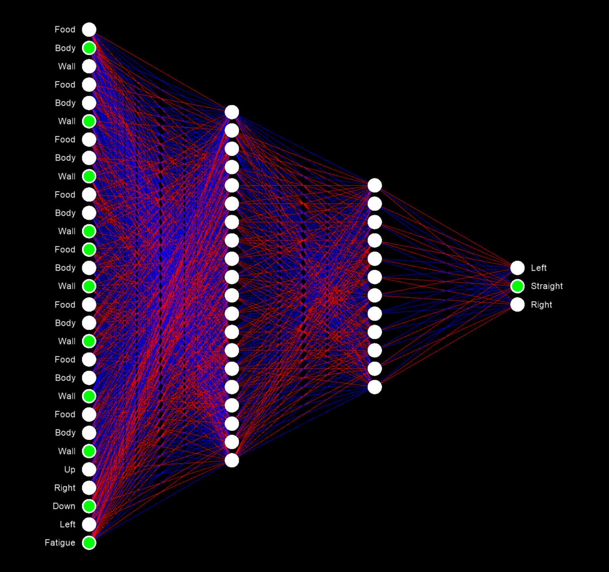
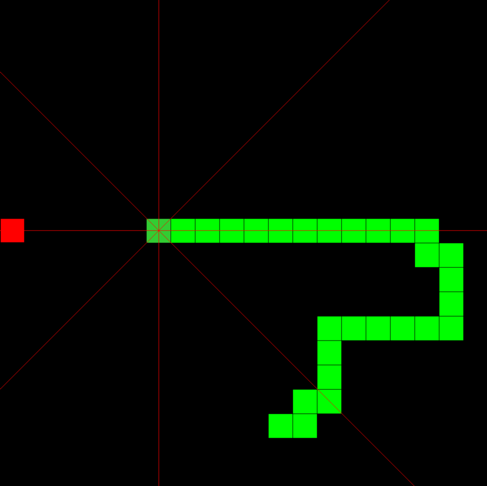

# AI snake

An AI that can play the classic retro game snake.

## Game rules
- The snake dies if it runs into itself or the wall.
- The snake dies if it takes too long to get food.
- 20 x 20 grid

## How the snake learns
Below is the snakes neural network, the structure is **29->20->12->3**.

  

For the inputs, the snake can see in eight directions, it looks for food, its body, \
and the walls. It also knows the direction it is currently moving in and how close \
it is to dying of fatigue. For the outputs, the snake has three possible actions: \
turn left, turn right, or continue straight.

  

The snake learns through a process called **Deep Q-learning**, which is a form of \
reinforcement learning. Because Snake is a complex game, it would be impractical to \
map out and assign values to every state. Instead, each time the snake moves, a \
target is calculated using the reward it received from that move and the highest \
estimated reward on the next move. It then uses this target to perform a \
backpropagation, which alters the weights of the neural network.

## More in depth explanation here:

